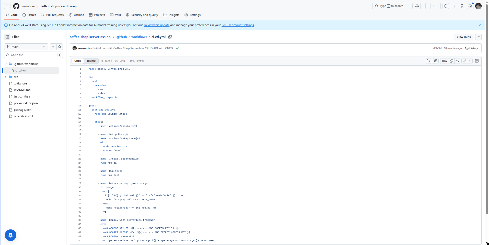
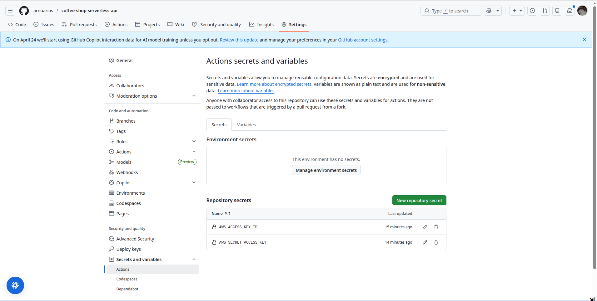
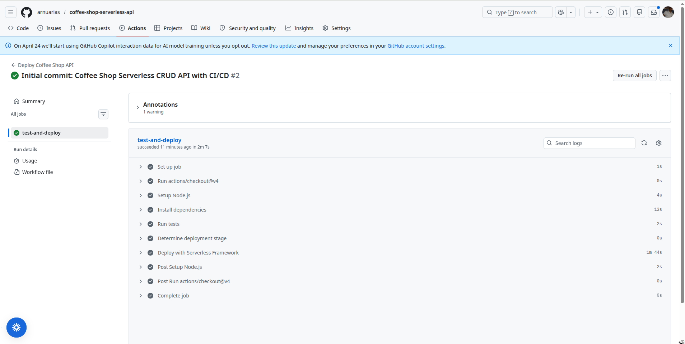
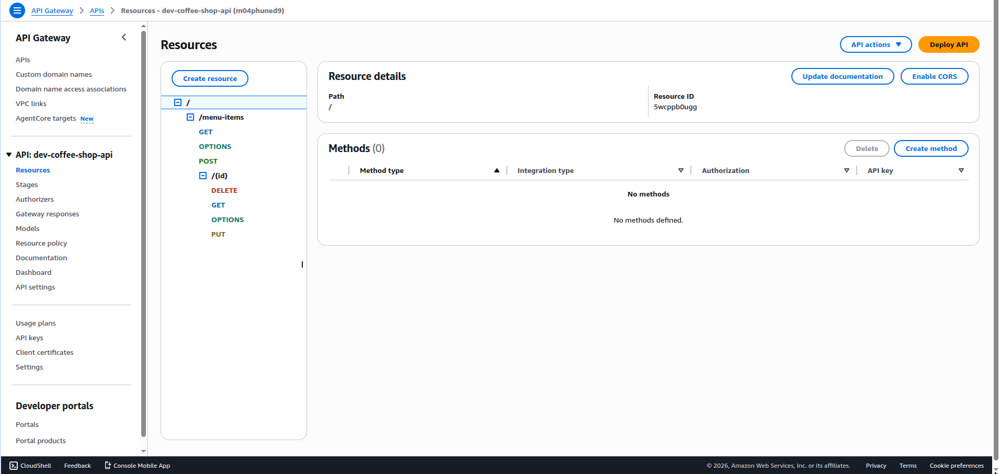
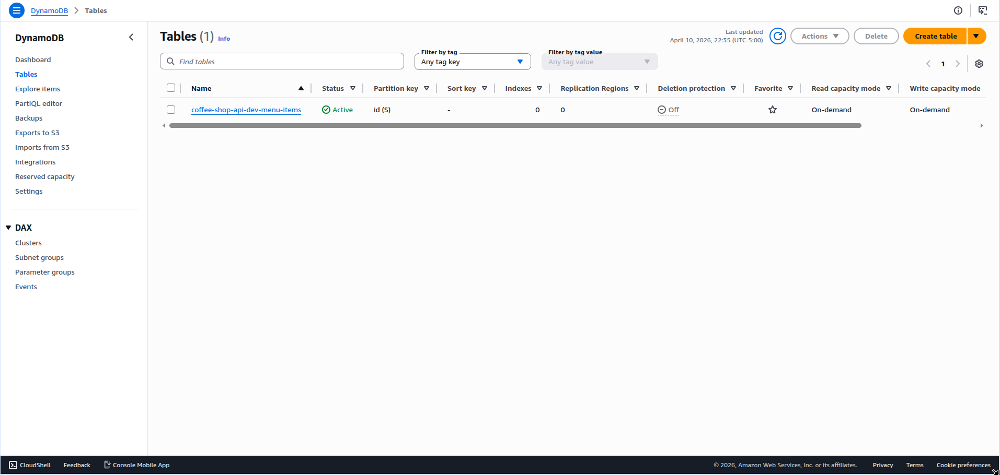

# Coffee Shop Serverless CRUD API

A fully serverless REST API for managing a Coffee Shop menu (beverages, pastries, etc.). Built with **JavaScript**, AWS Lambda, API Gateway, and DynamoDB using the **Serverless Framework**.

**5 separate Lambdas** • **No direct DynamoDB service proxy**

---

## Features

- Full CRUD operations (Create, Read, Update, Delete) for menu items
- 5 independent AWS Lambda functions
- Data stored in DynamoDB (Pay-per-request billing)
- Optimized Lambda packaging with **esbuild**
- Comprehensive **unit tests** with Jest (mocks for DynamoDB)
- Global Jest setup
- Multi-stage deployment (**dev** & **prod**) via GitHub Actions
- CORS enabled
- Clean, maintainable code structure

---

## Architecture

- **API Gateway** (REST API)
- **5 Lambda Functions** (one per operation)
- **DynamoDB Table** (`coffee-shop-api-{stage}-menu-items`)
- **IAM Roles** managed by Serverless Framework
- **CI/CD** with GitHub Actions

---

## API Endpoints

| Method | Endpoint                  | Description              | Protected |
|--------|---------------------------|--------------------------|---------|
| POST   | `/menu-items`             | Create a new menu item   | No      |
| GET    | `/menu-items`             | List all menu items      | No      |
| GET    | `/menu-items/{id}`        | Get a single menu item   | No      |
| PUT    | `/menu-items/{id}`        | Update a menu item       | No      |
| DELETE | `/menu-items/{id}`        | Delete a menu item       | No      |

### Example Requests

**Create Menu Item**
```bash
POST https://xxxx.execute-api.us-east-1.amazonaws.com/dev/menu-items
Content-Type: application/json

{
  "name": "Espresso",
  "category": "beverage",
  "price": 4.5,
  "description": "Strong and bold coffee"
}
```
---

## Prerequisites

- Node.js 20+
- AWS Account with IAM user (Access Key + Secret Key)
- GitHub Account

---

## Deployment
The project uses GitHub Actions for automated CI/CD.
  Deployment Rules

    Push to dev branch → Deploys to dev stage
    Push to master branch → Deploys to prod stage

  GitHub Secrets Required
    Go to Repository Settings → Secrets and variables → Actions and add:

      AWS_ACCESS_KEY_ID
      AWS_SECRET_ACCESS_KEY

---

## CI/CD Pipeline Setup
1. GitHub Actions Workflow
The pipeline is defined in .github/workflows/ci-cd.yml
Screenshot: GitHub Actions Workflow File


2. GitHub Secrets Configuration
Screenshot: GitHub Repository Secrets


3. Successful Deployment Example
Screenshot: Successful GitHub Actions Run


4. Deployed API in AWS Console
Screenshot: API Gateway Endpoints

Screenshot: DynamoDB Table


---

## Technologies Used

  Node.js 20 + JavaScript
  Serverless Framework v3
  AWS Lambda
  Amazon API Gateway
  Amazon DynamoDB
  AWS SDK v3
  esbuild (Lambda packaging)
  Jest (Unit Testing)
  GitHub Actions (CI/CD)